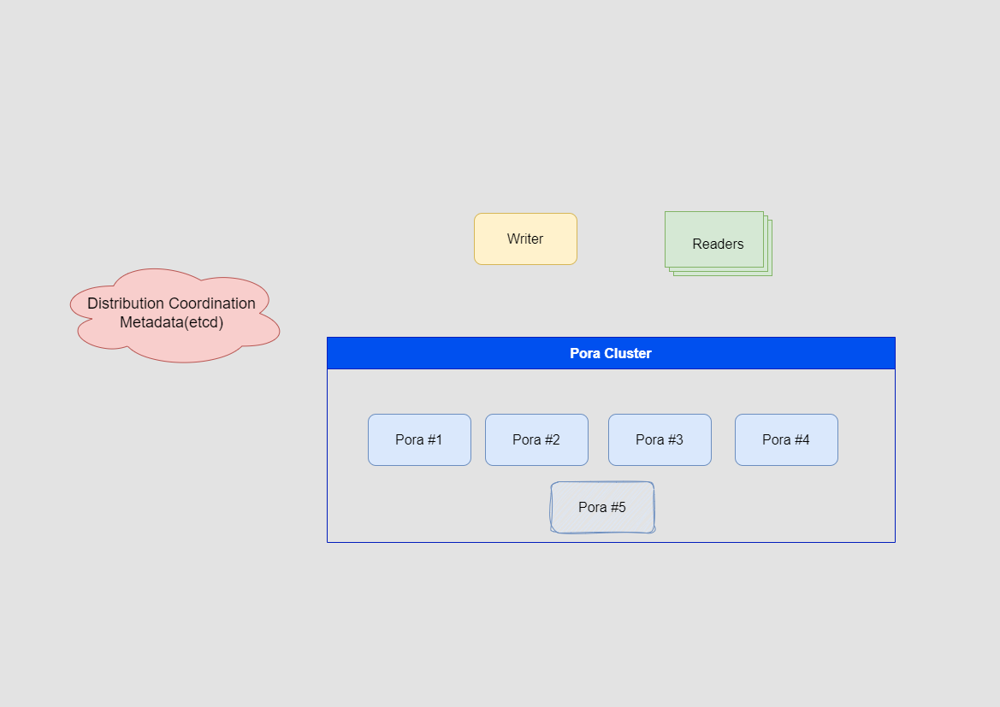
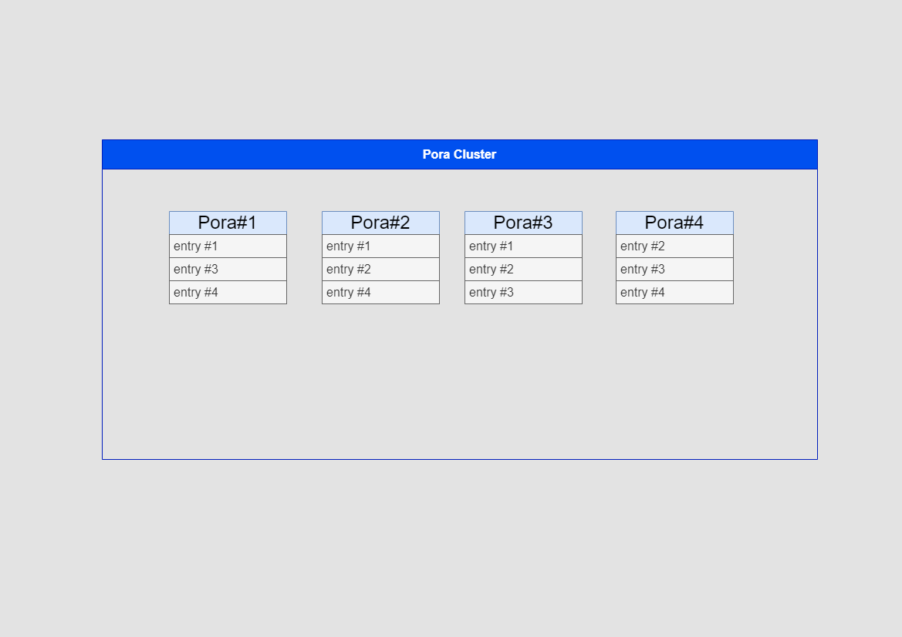

# PigeonMQ Design

## Introduction

PiegonMQ is a scalable, reliable and performant messaging system insipired by Apache Pulsar.

This is a study project of mine to learn how to design and implement a distributed messaging system. I try to keep the design simple enough but grasp the core concepts of a distributed messaging system.

## Architecture

## Components

- **Client**: The client library to interact with the PigeonMQ system including Producer, Consumer and Admin.
- **Service Layer**: The brokers that handle the messages and store them in the storage layer using the Distributed Porage API. It is designed to be stateless, horizontally scalable and provide the cache mechanism.
- **Storage Layer**: PigeonMQ uses Distributed Porage as the storage layer. Distributed Porage is a distributed append-only storage system designed to be scalable, available and performant designed for PigeonMQ.
- **Coordination**: PigeonMQ uses etcd as the coordination service to store the metadata of the topics, partitions, nodes and more.

## Managing Ledgers in a Distributed Environment

### Definitions

- `Qr`: Quorum read. The number of Poras that a read request needs to be sent to.
- `Qw`: Quorum write. The number of Poras that a write request needs to be sent to.
- `Qa`: Quorum ack. The number of acks required for a write to be considered successful.
- `N`: Number of nodes responsible for a ledger.
- `Pora`: A single node in the distributed Porage system.

### Architecture

Distributed Porage takes Leaderless Replication approach to achieve high availability and scalability with external concensus and dynamic membership management.



### Data Model

The data model of Distributed Porage is simple. It is an append-only storage system. The data is stored in the form of entries. Each entry is a byte array. The entries are stored in a ledger. A ledger is identified by a unique 64-bit integer.

Distributed Porage takes striping replicating approach, which means a ledger is replicated across multiple Poras and each Pora is responsible for a subset of the ledgers.



### Read and Write Path

Write Path:

1. Client requires the ownership of the ledger to write to. Now, let's call the client 'Writer'.
2. Writer sends the write request to `Qw` Poras.
3. Writer waits for `Qa` acks from the Poras.
4. If `Qa` acks are received within the timeout, the write is considered successful. Otherwise, the write is considered failed.

Read Path:

1. Client sends the read request to `Qr` Poras.
2. Client waits for `Qr` responses from the Poras.
3. If `Qr` responses are received within the timeout, the read is considered successful. Otherwise, the read is considered failed.

### Failure Detection and Handling

Definitions:

- `WriteRetryLimit`: The number of times a write request can be retried.

#### Writer Failure

Ownership of the ledger can be transferred to another client only if the writer is failed. And the detection of the writer failure is done by seeing the lock of the ledger is released. Lock release is done if one of the following conditions are met:

1. Writer failed to got acks from `Qa` Poras within the timeout for `WriteRetryLimit` times and there are enough Poras registered in `etcd` to form a quorum. In this case, the lock is released by the `Writer` itself.
2. The connection between the `Writer` and etcd is lost for some reason and the `Writer` is not able to renew the lock on time, the lock is released by the etcd.

#### Pora Failure

If a Pora is failed:

- If there is still another working Pora outside of this Pora Ensemble, we choose another Pora to replace the failed one and the Pora Ensemble is updated.
- If there is no working Pora outside of this Pora Ensemble, we need to wait for the failed Pora to recover. In this case, if the number of working Poras is less than `Qa`, the ledger is not available for writes.

### Recovery

When a Pora is failed, a new Pora is chosen to replace the failed one. The new Pora is chosen as a Pora in the cluster who has the most free disk space. It will fetch the entries which are stored in the old Pora from other healthy Poras.

## Service Discovery

PigeonMQ uses etcd as the coordination service to store the metadata of the topics, partitions, nodes and more. The metadata is used for the clients to find the Brokers and the Brokers to find the Poras.

## API

```Go
// NewClient creates a new client to interact with the PigeonMQ system.
func NewClient(etcdEndpoints []string) (*Client, error)

type MessageID uint64

type Message struct {
    Key string
    Payload []byte
}

// --- Producer ---

// CreateTopic creates a new topic with the given topic name.
type ProducerOptions struct {
    Topic string
    Partition int
    EtcdEndpoints []string
}

// CreateProducer creates a new producer with the given options.
func (c *Client) CreateProducer(options *ProducerOptions) (*Producer, error)

// Producer is a producer to produce messages to the PigeonMQ system.
type Producer struct {
    options *ProducerOptions
}

// Produce produces the given message to the PigeonMQ system.
func (p *Producer) Produce(message *Message) (MessageID, error)

// Close closes the producer.
func (p *Producer) Close() error

// --- Consumer ---

type ConsumerOptions struct {
    Topic string
    Partition int
    EtcdEndpoints []string
}

// CreateConsumer creates a new consumer with the given topic and partition.
func (c *Client) CreateConsumer(topic string, partition int) (*Consumer, error)

type Consumer struct {
    currentMessageID MessageID
    options *ConsumerOptions
}

// Consume consumes the next message from the PigeonMQ system.
//
// Block until a message is available.
func (c *Consumer) Consume() (*Message, error)

// Seek seeks to the given messageID.
func (c *Consumer) Seek(messageID MessageID) error

// Close closes the consumer.
func (c *Consumer) Close() error
```

**Note**:

- PiegonMQ does not provide the ability to create a topic and partition in the API. It only provides the ability to create a producer and consumer.
- PigeonMQ only provides the ability to consume messages from a single partition. More consumption modes will be added in the future.

## Administration

PigeonMQ provides the ability to create topic and partitions for users only in PigeonMQ-Admin-CLI. I make this decision to simplify the API design and provide a controlled environment.

## Miscellaneous

### Assumptions

For simplicity and to focus on the core concepts of a distributed messaging system, we make the following assumptions:

- The messages stored on disk will not be corrupted.

## `TODO`

- Verify the design by consulting ChatGPT and sample code.
- Implement the design.
